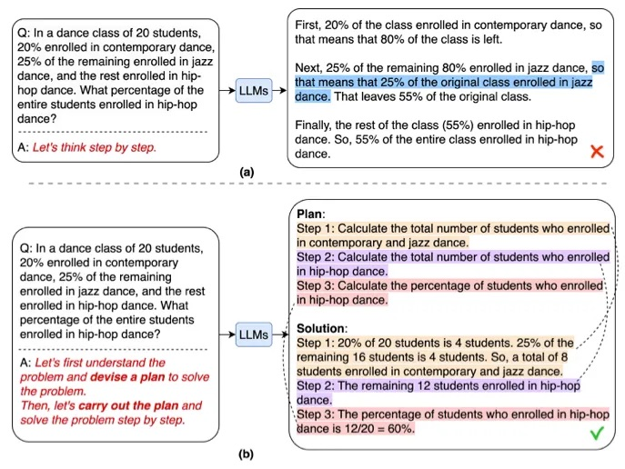

在[AutoGPT](https://github.com/Significant-Gravitas/AutoGPT)发布后，我们立即进行了尝试。首先想到的应用案例是自动化在线研究。对于手动研究任务，形成客观结论可能需要时间，有时甚至需要数周才能找到合适的资源和信息。看到AutoGPT在创建任务和执行任务方面表现良好，让我思考使用AI进行全面研究的巨大潜力，以及它对在线研究未来的意义。

但AutoGPT的问题在于，它通常会陷入无尽的循环，几乎每一步都需要人为干预，不断丢失进度跟踪，而且几乎从未真正完成任务。

尽管如此，在研究任务期间收集的信息和上下文（例如跟踪来源）丢失了，有时还会发生幻觉。

对利用AI进行在线研究的热情以及我发现的局限性，让我踏上了解决问题的使命，并与世界分享我的工作。这时，我创建了[AIPM研究者](https://github.com/ResearchRAG/aipm-researcher)——一个用于在线全面研究的自主代理。

在本文中，我们将分享引导我提出解决方案的步骤。

### 从无限循环到确定性结果
解决这些问题的第一步是寻找一种更确定性的解决方案，该方案最终能够保证在固定时间框架内完成任何研究任务，无需人为干预。

这时我们偶然发现了最近的论文[计划与解决](https://arxiv.org/abs/2305.04091)。该论文旨在为上述挑战提供更好的解决方案。这个想法非常简单，由两个组成部分构成：首先，制定一个计划将整个任务细分为更小的子任务，然后根据计划执行这些子任务。



就研究而言，首先创建与任务相关的研究问题大纲，然后确定性地为每个大纲项执行代理。这种方法通过将代理步骤分解为确定性的有限任务集，消除了任务完成的不确定性。一旦所有任务完成，代理就结束研究。

遵循这一策略，完成研究任务的可靠性提高到了100%。现在的挑战是，如何提高质量和速度？

### 追求客观和无偏见的结果
LLM（大型语言模型）面临的最大挑战是缺乏事实性和由于幻觉和过时的训练集（GPT目前训练的数据集是2021年的）导致的偏见回应。但讽刺的是，对于研究任务，正是需要优化这两个标准：事实性和偏见。

为了应对这些挑战，我们假设了以下几点：

- 大数定律 —— 更多的内容将导致较少的偏见结果。特别是如果收集得当的话。
- 利用LLM对事实信息进行总结可以显著提高结果的事实性。

经过相当长时间的LLM实验后，我们可以说，基础模型擅长的领域是给定内容的总结和改写。因此，从理论上讲，如果LLM只审查给定的内容并进行总结和改写，可能会显著减少幻觉。

此外，假设给定的内容是无偏见的，或者至少包含一个话题的所有观点和信息，那么改写的结果也将是无偏见的。那么如何使内容无偏见呢？[大数定律](https://en.wikipedia.org/wiki/Law_of_large_numbers)。换句话说，如果足够多的相关网站被爬取，偏见信息的可能性将大大减少。因此，想法是只爬取足够多的网站，以形成对任何话题的客观意见。

太好了！听起来现在我们有了一个如何创建确定性、事实性和无偏见结果的想法。但速度问题呢？

### 加快研究过程
AutoGPT的另一个问题是它同步工作。它的主要思想是创建一个任务列表，然后逐个执行它们。所以，比如说，如果一个研究任务需要访问20个网站，每个网站大约需要一分钟来抓取和总结，那么整个研究任务至少需要20分钟。这是在假设它最终会停止的情况下。但如果我们可以并行化代理工作呢？

通过利用Python库如asyncio，代理任务已被优化为并行工作，从而显著减少了研究时间。

```python
# 创建一个列表来保存协程代理任务
tasks = [async_browse(url, query, self.websocket) for url in await new_search_urls]

# 收集结果，一旦它们变得可用
responses = await asyncio.gather(*tasks, return_exceptions=True)
```

在上面的例子中，我们并行触发所有URL的抓取，一旦完成，再继续执行任务。根据许多测试，平均研究任务大约需要三分钟（!!）。这比AutoGPT快了85%。

### 完成研究报告
最后，在尽可能多地收集关于给定研究任务的信息之后，挑战是如何编写一份全面的报告。

在尝试了几种OpenAI模型甚至开源之后，我得出结论，目前最好的结果是由LLMs实现的。任务很直接 —— 为LLMs提供所有汇总信息的上下文，并要求它根据原始研究任务写一份详细报告。

提示如下：
```commandline
"{research_summary}" 使用上述信息，回答以下问题或主题："{question}" 并编写一份详细报告 —— 报告应专注于问题的答案，结构良好，信息丰富，深入，如果可能的话包含事实和数字，最少1200字，并使用markdown语法和apa格式。在报告的最后以apa格式编写所有源网址。你应该仅根据给定的信息编写报告，而不是其他任何东西。
```

结果相当令人印象深刻，极少数样本中有轻微的幻觉，但可以合理假设随着GPT的改进，结果只会变得更好。

### 最终架构
现在我们已经回顾了AIPM研究者的必要步骤，让我们分解最终架构，如下所示：

<div align="center">
 
</div>

更具体地说：
- 生成研究问题大纲，形成对任何给定任务的客观意见。
- 对于每个研究问题，触发一个爬虫代理，该代理为与给定任务相关的在线资源抓取信息。
- 对于每个抓取的资源，跟踪、筛选并仅在包含相关信息时进行总结。
- 最后，汇总所有总结的来源并生成最终研究报告。

### 前进的方向
在线研究自动化的未来正朝着重大变革前进。随着AI的不断改进，AI代理能够为我们日常需求的任何方面执行全面研究任务只是时间问题。AI研究可以颠覆金融、法律、学术、健康和零售等领域，将我们每次研究的时间减少95%，同时在不断增长的在线信息洪流中优化事实性和无偏见报告。

想象一下，如果AI最终能够理解和分析任何形式的在线内容 —— 视频、图像、图表、表格、评论、文本、音频。再想象一下，如果它能够在单个提示中支持和分析数十万字的汇总信息。甚至想象一下，AI最终能够改进推理和分析，使其更适合得出新的和创新的研究结论。而且它可以在几分钟内完成所有这些，如果不是几秒钟的话。

这只是一个时间和[AIPM研究者](https://github.com/ResearchRAG/aipm-researcher)所关乎的事情。