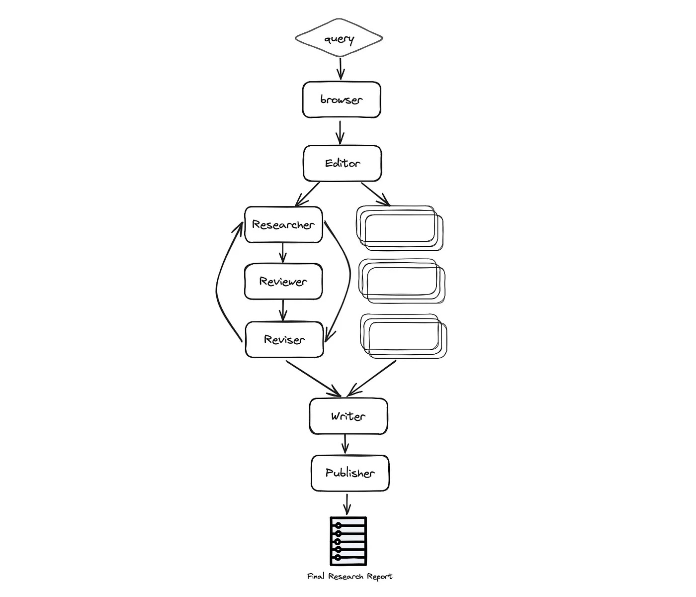

# 介绍AIPM研究者多代理助手
### 学习如何使用LangGraph和一群专业化的AI代理构建一个自主研究助手

自从AIPM研究者最初发布以来，仅仅一年的时间，构建、测试和部署AI代理的方法已经显著发展。这是目前AI进步的性质和速度。最初简单的零次或少次提示，迅速发展到代理函数调用，RAG，现在最终发展到代理工作流（也称为“流程工程”）。

Andrew Ng最近[表示](https://www.deeplearning.ai/the-batch/how-agents-can-improve-llm-performance/)，“我认为AI代理工作流将推动今年的巨大AI进步 —— 甚至可能超过下一代基础模型。这是一个重要的趋势，我敦促所有从事AI工作的人士关注它。”

在本文中，您将了解到为什么多代理工作流是当前的最佳标准，以及如何使用LangGraph构建最优的自主研究多代理助手。

要跳过本教程，请随时查看[AIPM研究者 x LangGraph](https://github.com/ResearchRAG/aipm-researcher/tree/master/multi_agents)的Github仓库。

# 介绍LangGraph
LangGraph是LangChain的扩展，旨在创建代理和多代理流程。它增加了创建循环流程的能力，并内置了记忆功能 —— 这两个重要属性对于创建代理都非常重要。

LangGraph为开发人员提供了高度的可控性，对于创建自定义代理和流程至关重要。几乎所有生产中的代理都针对它们试图解决的特定用例进行了定制。LangGraph为您提供了创建任意自定义代理的灵活性，同时提供了直观的开发体验。

不再闲聊，让我们开始构建吧！

# 构建终极自主研究代理
通过利用LangGraph，研究过程可以通过利用具有专业技能的多个代理，在深度和质量上得到显著改进。让每个代理只专注于特定的技能，可以更好地分离关注点，可定制性，并且随着项目的增长，可以进一步规模化发展。

受到最近的STORM论文的启发，这个示例展示了一群AI代理如何协作开展给定主题的研究，从规划到发布。这个示例还将利用领先的自主研究代理AIPM研究者。

### 研究代理团队
研究团队由七个LLM代理组成：

* **主编** — 监督研究过程并管理团队。这是协调其他代理的“主”代理，使用LangGraph作为主要的LangGraph接口。
* **AIPM研究者** — 一个专门的自主代理，针对给定主题进行深入研究。
* **编辑** — 负责规划研究大纲和结构。
* **审稿人** — 根据一组标准验证研究结果的正确性。
* **修订者** — 根据审稿人的反馈修订研究结果。
* **作者** — 负责编写最终报告。
* **发布者** — 负责以各种格式发布最终报告。

### 架构
如下方所见，自动化过程基于以下阶段：规划研究、数据收集和分析、审查和修订、撰写报告，最后发布：



更具体地说，流程如下：

* **浏览器（gpt-researcher）** — 根据给定的研究任务，浏览互联网进行初步研究。这一步对于LLM根据最新和相关信息规划研究过程至关重要，而不是仅依赖于预训练数据来完成特定任务或主题。
* **编辑** — 根据初步研究规划报告大纲和结构。编辑还负责根据规划的大纲触发并行研究任务。
* 对于每个大纲主题（并行）：
  * **研究者（gpt-researcher）** — 对子主题进行深入研究并撰写草稿。该代理在后台利用AIPM研究者Python包，以优化、深入和事实性的研究报告。
  * **审稿人** — 根据一组指南验证草稿的正确性，并向修订者提供反馈（如果有）。
  * **修订者** — 根据审稿人的反馈修订草稿，直到满意为止。
* **作者** — 汇编并撰写最终报告，包括引言、结论和参考文献部分。
* **发布者** — 将最终报告发布到多种格式，如PDF、Docx、Markdown等。

* 我们不会深入所有代码，因为代码量很大，但主要关注我发现有价值的有趣部分。

## 定义图形状态
我最喜欢的LangGraph功能之一是状态管理。LangGraph中的状态通过结构化方法实现，开发人员定义一个封装了应用程序整个状态的GraphState。图中的每个节点都可以修改这个状态，允许基于交互的不断发展的上下文进行动态响应。

像每个技术设计的开始一样，考虑整个应用程序中的数据模式是关键。在这种情况下，我们将定义一个ResearchState如下：

```python
class ResearchState(TypedDict):
    task: dict
    initial_research: str
    sections: List[str]
    research_data: List[dict]
    # 报告布局
    title: str
    headers: dict
    date: str
    table_of_contents: str
    introduction: str
    conclusion: str
    sources: List[str]
    report: str
```

如上所见，状态被分为两个主要区域：研究任务和报告布局内容。当数据通过图形代理流通时，每个代理将依次基于现有状态生成新数据并更新它，以便后续代理在图中进一步处理。

然后，我们可以使用以下方式初始化图形：

```python
from langgraph.graph import StateGraph
workflow = StateGraph(ResearchState)
```

使用LangGraph初始化图形
如上所述，多代理开发的一个优点是构建每个代理具有专业和限定的技能。以使用AIPM研究者Python包的Researcher代理为例：

```python
from gpt_researcher import GPTResearcher

class ResearchAgent:
    def __init__(self):
        pass
  
    async def research(self, query: str):
        # 初始化研究者
        researcher = GPTResearcher(parent_query=parent_query, query=query, report_type=research_report, config_path=None)
        # 对给定查询进行研究
        await researcher.conduct_research()
        # 编写报告
        report = await researcher.write_report()
  
        return report
```

如上所见，我们创建了一个Research代理的实例。现在假设我们已经为团队的每个代理完成了相同的操作。在创建了所有代理之后，我们将使用LangGraph初始化图形：

```python
def init_research_team(self):
    # 初始化代理
    editor_agent = EditorAgent(self.task)
    research_agent = ResearchAgent()
    writer_agent = WriterAgent()
    publisher_agent = PublisherAgent(self.output_dir)
    
    # 定义带有ResearchState的Langchain StateGraph
    workflow = StateGraph(ResearchState)
    
    # 为每个代理添加节点
    workflow.add_node("browser", research_agent.run_initial_research)
    workflow.add_node("planner", editor_agent.plan_research)
    workflow.add_node("researcher", editor_agent.run_parallel_research)
    workflow.add_node("writer", writer_agent.run)
    workflow.add_node("publisher", publisher_agent.run)
    
    workflow.add_edge('browser', 'planner')
    workflow.add_edge('planner', 'researcher')
    workflow.add_edge('researcher', 'writer')
    workflow.add_edge('writer', 'publisher')
    
    # 设置起始和结束节点
    workflow.set_entry_point("browser")
    workflow.add_edge('publisher', END)
    
    return workflow
```

如上所见，创建LangGraph图形非常简单，由三个主要功能组成：add_node、add_edge和set_entry_point。通过这些主要功能，您可以首先向图中添加节点，连接边，最后设置起始点。

专注检查：如果您一直在遵循代码和架构，您会注意到在上述初始化中缺少了审稿人和修订者代理。让我们深入了解！

## 图形中的图形，支持有状态的并行化
这是我使用LangGraph的体验中最令人兴奋的部分！这个自主助手最激动人心的功能之一是为每个研究任务提供并行运行，这些任务将根据一组预定义的准则进行审查和修订。

知道如何在流程中利用并行工作是优化速度的关键。但是，如果所有代理都报告相同的状态，您将如何触发并行代理工作？这可能会导致竞争条件和最终数据报告的不一致性。为解决这个问题，您可以创建一个子图，该子图将从主LangGraph实例触发。这个子图将拥有每个并行运行自己的状态，这将解决所提出的问题。

正如我们之前所做的，让我们定义LangGraph状态及其代理。由于这个子图基本上审查和修订研究草稿，我们将用草稿信息定义状态：

```python
class DraftState(TypedDict):
    task: dict
    topic: str
    draft: dict
    review: str
    revision_notes: str
```

如DraftState中所见，我们主要关心讨论的主题，以及审稿人和修订者之间的交流，以完成子主题研究报告。为了创建循环条件，我们将利用LangGraph的最后一个重要部分，即条件边：

```python
async def run_parallel_research(self, research_state: dict):
    workflow = StateGraph(DraftState)
    
    workflow.add_node("researcher", research_agent.run_depth_research)
    workflow.add_node("reviewer", reviewer_agent.run)
    workflow.add_node("reviser", reviser_agent.run)
    
    # 设置边 researcher->reviewer->reviser->reviewer...
    workflow.set_entry_point("researcher")
    workflow.add_edge('researcher', 'reviewer')
    workflow.add_edge('reviser', 'reviewer')
    workflow.add_conditional_edges('reviewer',
                                   (lambda draft: "accept" if draft['review'] is None else "revise"),
                                   {"accept": END, "revise": "reviser"})
```

通过定义条件边，如果审稿人有审稿意见，则图表将指向修订者，或者最终草稿将以最终草稿结束循环。如果您回顾我们已经构建的主图，您会看到这个并行工作是在名为“researcher”的节点下进行的，该节点由主编代理调用。

运行研究助手
在完成代理、状态和图形后，是时候运行我们的研究助手了！为了更容易定制，助手将使用给定的任务.json文件运行：

```json
{
  "query": "人工智能是否处于炒作周期？",
  "max_sections": 3,
  "publish_formats": {
    "markdown": true,
    "pdf": true,
    "docx": true
  },
  "follow_guidelines": false,
  "model": "gpt-4-turbo",
  "guidelines": [
    "报告必须用APA格式编写",
    "每个子部分必须包括使用超链接的辅助来源。如果不存在，则擦除子部分或重写为前一部分的一部分",
    "报告必须用西班牙语编写"
  ]
}
```

任务对象非常自解释，但请注意，如果follow_guidelines为false，则会导致图表忽略修订步骤和定义的准则。此外，max_sections字段定义了要研究的子标题数量。较少的将生成较短的报告。

运行助手将生成Markdown、PDF和Docx等格式的最终研究报告。

要下载并运行示例，请查看AIPM研究者x LangGraph的[开源页面](https://github.com/ResearchRAG/aipm-researcher/tree/master/multi_agents)。

## 接下来是什么？
展望未来，有许多令人兴奋的事情要考虑。人为干预对于优化AI体验至关重要。让人类帮助助手修订并专注于正确的研究计划、主题和大纲，将提高整体质量和体验。此外，通常，在整个AI流程中依靠人为干预确保正确性、控制感和确定性结果。很高兴看到LangGraph已经原生支持这一点，如这里所见。

此外，支持关于网络和本地数据的研究对于许多类型的商业和个人用例至关重要。

最后，可以做出更多努力来提高检索来源的质量，并确保最终报告以最佳故事线构建。

LangGraph和多代理协作的一个进步将是助手能够根据给定任务动态规划和生成图形。这一愿景将允许助手为给定任务选择仅有的代理子集，并根据本文介绍的图形基础规划他们的策略，开启一个全新的可能性世界。鉴于AI领域的创新速度，AIPM研究者的一个新的颠覆性版本发布不会太久。期待未来带来什么！

要跟踪此项目的持续进展和更新，请加入我们的Discord社区。如往常一样，如果您有任何反馈或进一步问题，请在下方评论！