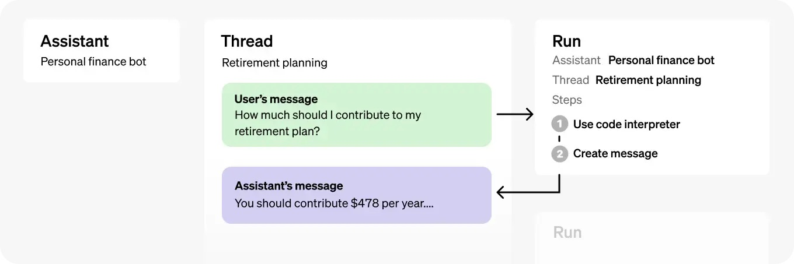
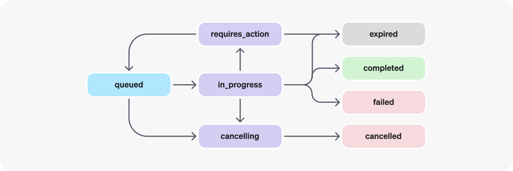

OpenAI在[开创性的DevDay](https://openai.com/blog/new-models-and-developer-products-announced-at-devday)上再次发力，展示了OpenAI工具、产品和服务套件的最新改进。其中一个重大发布是新的[助手API](https://platform.openai.com/docs/assistants/overview)，它使开发人员更容易构建具有目标并可以调用模型和工具的辅助AI应用程序。

新的助手API目前支持三种类型的工具：代码解释器、检索和函数调用。尽管您可能期望检索工具支持在线信息检索（例如搜索API或作为ChatGPT插件），但它目前仅支持原始数据，如文本或CSV文件。

本博客将演示如何使用函数调用工具，利用最新的助手API与在线信息。

要跳过下面的教程，请随时查看完整的[Github Gist](https://gist.github.com/ResearchRAG/579822cd42d52d80db1e1c1ff82ffffd)。

在高层次上，典型的助手API集成包括以下步骤：

- 通过定义自定义指令并选择模型，在API中创建一个[助手](https://platform.openai.com/docs/api-reference/assistants/createAssistant)。如果有帮助，启用像代码解释器、检索和函数调用这样的工具。
- 当用户开始对话时，创建一个[线程](https://platform.openai.com/docs/api-reference/threads)。
- 随着用户提出问题，向线程添加[消息](https://platform.openai.com/docs/api-reference/messages)。
- 在线程上[运行](https://platform.openai.com/docs/api-reference/runs)助手以触发响应。这将自动调用相关工具。

正如您下面看到的，助手对象包括用于存储和处理助手与用户之间对话会话的线程，以及用于在线程上调用助手的运行。



让我们继续一步一步地实现这些步骤！作为示例，我们将构建一个金融GPT，它可以提供有关金融问题洞见。我们将使用[OpenAI Python SDK v1.2](https://github.com/openai/openai-python/tree/main#installation)和[Tavily搜索API](https://tavily.com)。

首先，让我们定义助手的指令：

```python
assistant_prompt_instruction = """您是一位金融专家。
您的目标是基于互联网上的信息提供答案。
您必须使用提供的Tavily搜索API函数查找相关的在线信息。
您永远不应使用自己的知识回答问题。
请在答案末尾包含相关的URL来源。
"""
```

接下来，让我们完成步骤1，并使用最新的[LLMs Turbo模型](https://github.com/openai/openai-python/tree/main#installation)（128K上下文）和调用函数使用[Tavily网络搜索API](https://tavily.com/)创建助手：

```python
# 创建助手
assistant = client.beta.assistants.create(
    instructions=assistant_prompt_instruction,
    model="gpt-4-1106-preview",
    tools=[{
        "type": "function",
        "function": {
            "name": "tavily_search",
            "description": "从网络上获取有关近期事件的信息。",
            "parameters": {
                "type": "object",
                "properties": {
                    "query": {"type": "string", "description": "要使用的搜索查询。例如：'Nvidia股票表现的最新新闻'"},
                },
                "required": ["query"]
            }
        }
    }]
)
```

步骤2+3非常简单，我们将启动一个新线程，并用用户消息更新它：

```python
thread = client.beta.threads.create()
user_input = input("您：")
message = client.beta.threads.messages.create(
    thread_id=thread.id,
    role="user",
    content=user_input,
)
```

最后，我们将在线程上运行助手以触发函数调用并获取响应：

```python
run = client.beta.threads.runs.create(
    thread_id=thread.id,
    assistant_id=assistant_id,
)
```

到目前为止一切顺利！但这里有点混乱。与常规GPT API不同，助手API不会返回同步响应，而是返回状态。这允许助手之间的异步操作，但需要更多的开销来获取状态并手动处理每个状态。



为了管理这个状态生命周期，让我们构建一个可以重复使用并处理等待各种状态（如‘requires_action’）的函数：

```python
# 等待运行完成的函数
def wait_for_run_completion(thread_id, run_id):
    while True:
        time.sleep(1)
        run = client.beta.threads.runs.retrieve(thread_id=thread_id, run_id=run_id)
        print(f"当前运行状态：{run.status}")
        if run.status in ['completed', 'failed', 'requires_action']:
            return run
```

这个函数将在运行尚未最终确定的情况下休眠，例如在完成或需要来自函数调用的行动的情况下。

我们快到了！最后，让我们处理助手想要调用网络搜索API的情况：

```python
# 处理工具输出提交的函数
def submit_tool_outputs(thread_id, run_id, tools_to_call):
    tool_output_array = []
    for tool in tools_to_call:
        output = None
        tool_call_id = tool.id
        function_name = tool.function.name
        function_args = tool.function.arguments

        if function_name == "tavily_search":
            output = tavily_search(query=json.loads(function_args)["query"])

        if output:
            tool_output_array.append({"tool_call_id": tool_call_id, "output": output})

    return client.beta.threads.runs.submit_tool_outputs(
        thread_id=thread_id,
        run_id=run_id,
        tool_outputs=tool_output_array
    )
```

如上所见，如果助手推理出应该触发函数调用，我们提取给定的所需函数参数并将它们传回可运行的线程。我们在下面看到的那样捕获这个状态并调用我们的函数：

```python
if run.status == 'requires_action':
    run = submit_tool_outputs(thread.id, run.id, run.required_action.submit_tool_outputs.tool_calls)
    run = wait_for_run_completion(thread.id, run.id)
```

就是这样！我们现在有一个可以用于使用实时在线信息回答金融问题的OpenAI助手。以下是完整的可运行代码：

```python
import os
import json
import time
from openai import OpenAI
from tavily import TavilyClient

# 使用API密钥初始化客户端
client = OpenAI(api_key=os.environ["OPENAI_API_KEY"])
tavily_client = TavilyClient(api_key=os.environ["TAVILY_API_KEY"])

assistant_prompt_instruction = """您是一位金融专家。
您的目标是基于互联网上的信息提供答案。
您必须使用提供的Tavily搜索API函数查找相关的在线信息。
您永远不应使用自己的知识回答问题。
请在答案末尾包含相关的URL来源。
"""

# 执行Tavily搜索的函数
def tavily_search(query):
    search_result = tavily_client.get_search_context(query, search_depth="advanced", max_tokens=8000)
    return search_result

# 等待运行完成的函数
def wait_for_run_completion(thread_id, run_id):
    while True:
        time.sleep(1)
        run = client.beta.threads.runs.retrieve(thread_id=thread_id, run_id=run_id)
        print(f"当前运行状态：{run.status}")
        if run.status in ['completed', 'failed', 'requires_action']:
            return run

# 处理工具输出提交的函数
def submit_tool_outputs(thread_id, run_id, tools_to_call):
    tool_output_array = []
    for tool in tools_to_call:
        output = None
        tool_call_id = tool.id
        function_name = tool.function.name
        function_args = tool.function.arguments

        if function_name == "tavily_search":
            output = tavily_search(query=json.loads(function_args)["query"])

        if output:
            tool_output_array.append({"tool_call_id": tool_call_id, "output": output})

    return client.beta.threads.runs.submit_tool_outputs(
        thread_id=thread_id,
        run_id=run_id,
        tool_outputs=tool_output_array
    )

# 从线程打印消息的函数
def print_messages_from_thread(thread_id):
    messages = client.beta.threads.messages.list(thread_id=thread_id)
    for msg in messages:
        print(f"{msg.role}: {msg.content[0].text.value}")

# 创建助手
assistant = client.beta.assistants.create(
    instructions=assistant_prompt_instruction,
    model="gpt-4-1106-preview",
    tools=[{
        "type": "function",
        "function": {
            "name": "tavily_search",
            "description": "从网络上获取有关近期事件的信息。",
            "parameters": {
                "type": "object",
                "properties": {
                    "query": {"type": "string", "description": "要使用的搜索查询。例如：'Nvidia股票表现的最新新闻'"},
                },
                "required": ["query"]
            }
        }
    }]
)
assistant_id = assistant.id
print(f"助手ID: {assistant_id}")

# 创建线程
thread = client.beta.threads.create()
print(f"线程: {thread}")

# 持续的对话循环
while True:
    user_input = input("您：")
    if user_input.lower() == 'exit':
        break

    # 创建消息
    message = client.beta.threads.messages.create(
        thread_id=thread.id,
        role="user",
        content=user_input,
    )

    # 创建运行
    run = client.beta.threads.runs.create(
        thread_id=thread.id,
        assistant_id=assistant_id,
    )
    print(f"运行ID: {run.id}")

    # 等待运行完成
    run = wait_for_run_completion(thread.id, run.id)

    if run.status == 'failed':
        print(run.error)
        continue
    elif run.status == 'requires_action':
        run = submit_tool_outputs(thread.id, run.id, run.required_action.submit_tool_outputs.tool_calls)
        run = wait_for_run_completion(thread.id, run.id)

    # 从线程打印消息
    print_messages_from_thread(thread.id)
```

助手可以使用额外的检索信息、OpenAI的编码解释器等进一步定制和改进。此外，您可以继续添加更多函数工具，使助手更智能。

如果您有任何进一步的问题，请随时在下方留言！