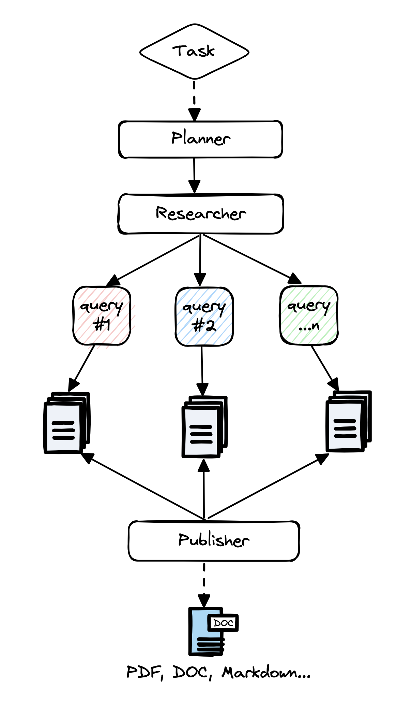

# 引言

 
 

 
 
 
 

**[AIPM研究者](https://gptr.dev) 是一个为多种任务设计的全面在线研究的自主代理。**

该代理能够生成详尽、事实性和无偏见的研究报告，提供定制选项以专注于相关资源、大纲和课程。受最近的[计划与解决](https://arxiv.org/abs/2305.04091)和[RAG](https://arxiv.org/abs/2005.11401)论文的启发，AIPM研究者解决了速度、确定性和可靠性的问题，通过并行代理工作而非同步操作，提供了更稳定的性能和更快的速度。

## 为什么选择AIPM研究者？

- 形成手动研究任务的客观结论可能需要时间，有时需要数周才能找到合适的资源和信息。
- 当前的大型语言模型（LLMs）训练于过去和过时的信息，存在严重的幻觉风险，使它们对研究任务几乎不相关。
- 当前LLMs的输出限制在短令牌内，不足以生成长篇详细的研究报告（2000+单词）。
- 支持网络搜索的解决方案（如ChatGPT + Web插件），只考虑有限的资源和内容，在某些情况下可能导致表面化的结论或有偏见的答案。
- 仅使用资源选择可能会在确定研究问题或任务的正确结论时产生偏见。

## 架构
主要思想是运行“规划者”和“执行者”代理，其中规划者生成研究问题，执行者代理根据每个生成的研究问题寻找最相关的信息。最后，规划者过滤和聚合所有相关信息并创建研究报告。   
代理利用gpt-4o-mini和gpt-4o（128K上下文）完成研究任务。我们仅在必要时使用它们以优化成本。**平均研究任务大约需要3分钟完成，成本约为0.1美元。**

更具体地说：
* 根据研究查询或任务创建特定领域的代理。
* 生成一组研究问题，共同形成对任何给定任务的客观意见。
* 对于每个研究问题，触发一个爬虫代理，该代理抓取与给定任务相关的在线资源。
* 对于每个抓取的资源，根据相关信息进行总结，并跟踪其来源。
* 最后，过滤和聚合所有总结的来源并生成最终的研究报告。

## 演示
<iframe height="400" width="700" src="https://github.com/ResearchRAG/aipm-researcher/assets/13554167/a00c89a6-a295-4dd0-b58d-098a31c40fda"  frameborder="0" allow="autoplay; encrypted-media" allowfullscreen></iframe>

## 教程
 - [工作原理](https://medium.com/better-programming/how-i-built-an-autonomous-ai-agent-for-online-research-93435a97c6c) 
 - [如何安装](https://www.loom.com/share/04ebffb6ed2a4520a27c3e3addcdde20?sid=da1848e8-b1f1-42d1-93c3-5b0b9c3b24ea) 
 - [实时演示](https://www.loom.com/share/6a3385db4e8747a1913dd85a7834846f?sid=a740fd5b-2aa3-457e-8fb7-86976f59f9b8) 
 - [主页](https://gptr.dev) 

## 特点
- 📝 生成研究、大纲、资源和课程报告
- 📜 能够生成长篇详细的研究报告（超过2000单词）
- 🌐 每次研究聚合20多个网络资源，形成客观和事实性的结论
- 🖥️ 包括易于使用的网络界面（HTML/CSS/JS）
- 🔍 支持JavaScript的网络资源抓取
- 📂 跟踪访问和使用网络资源的上下文
- 📄 将研究报告导出为PDF、Word等格式

让我们从[这里](/docs/gpt-researcher/getting-started/)开始！